************************
Accuracy Improvements
************************

Calibration
=============

Calibrating your camera improves detection accuracy in cases where vehicle plates are captured at a steep angle.  For example, the the plate below is captured at 40+ degree horizontal angle, and will normally not be recognized as a license plate.  

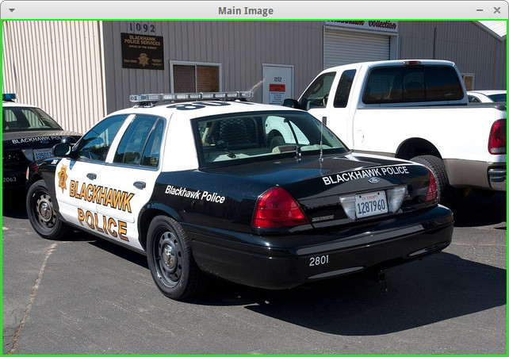

The camera calibration helps in cases where the camera is capturing from a fixed position, and all plates generally are seen at the same angle.  This feature is best for short-angle cameras or cameras capturing at a close distance.

Use the tool named "openalpr-utils-calibrate" to calibrate your camera.  The utility needs a single example image to begin.  This image should be taken from the camera you wish to calibrate and should have a license plate that represents the typical distance/angle of plate captured on this camera.

    ./openalpr-utils-calibrate camera_image.jpg

There are sliders at the top of the screen that control the skew.  Adjust the sliders until the plate looks like it is seen from straight-on with no angle.  Left-click and drag to draw a box (with the correct aspect ratio) to test if the plate is the correct size.

You can also right-click and drag to move the image within the frame.  Because we are distorting the original image, the frame will be clipped.  If frames are unlikely to be seen in certain areas (on the ceiling for example) you may want to adjust the plate image to ensure that those areas will be cropped.

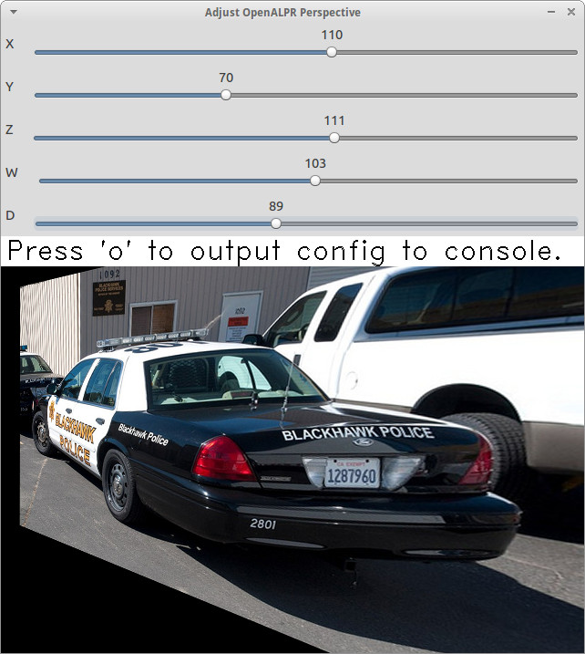

Once you're satisified with the parameters you've chosen, press the 'o' key.  This produces a line of configuration in the terminal that can be copied directly into openalpr.conf as the "prewarp" config.  This will apply the camera calibration settings against each image before it is used for plate recognition.

Now test the new settings on a few images from this camera to make sure that the new calibration improves accuracy.

    ./alpr camera_image.jpg

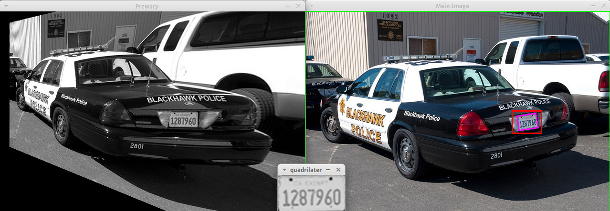

Notice that the license plate is now correctly detected.  You can view the calibrated image results by enabling the "prewarp" debug option in the openalpr.conf file.  Test the accuracy on many different images from the camera before accepting the configuration.  Other calibration angles could produce superior results.

Pattern Matching
===================

The pattern matching feature runs the topN results against a Regular expression matcher to find results that match common license plate patterns.  The regex patterns are customizable and can be found in runtime_data/postprocess/``*``.patterns

For example, using a pattern against this Czechoslovakian plate results in only one possible match (which is the correct one).  

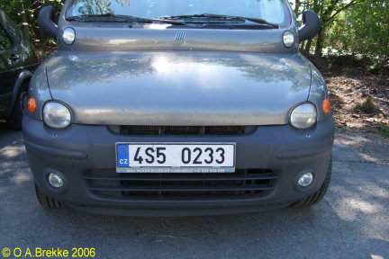

The cz patterns are:
 - cz    #@#####
 - cz    #@@####

Results for this plate, notice the pattern matches 4S50233:

::

    [mhill@mhill-linux tmp]$ alpr -c eu -p cz cz_4s50233.jpg -n 40
    plate0: 40 results
        - 4S5O233     confidence: 90.947      pattern_match: 0
        - 4S5O23      confidence: 87.8683     pattern_match: 0
        - 4S5O23      confidence: 85.1644     pattern_match: 0
        - 4S5O23S     confidence: 84.5445     pattern_match: 0
        - 4S5O23B     confidence: 83.7395     pattern_match: 0
        - 4S5O2S3     confidence: 83.3698     pattern_match: 0
        - 4S5O23G     confidence: 83.1375     pattern_match: 0
        - 4S50233     confidence: 83.0457     pattern_match: 1
        - 4S5O2B3     confidence: 82.5635     pattern_match: 0
        - 4S5O2       confidence: 82.0857     pattern_match: 0
        - 4S5O2G3     confidence: 81.5684     pattern_match: 0
        - 4S5O2J3     confidence: 81.0409     pattern_match: 0
        - 4S5O2S      confidence: 80.2911     pattern_match: 0
        ... more results that do not match ...

You can utilize this from the library code by calling "setDefaultRegion(string region)" with the name of the pattern you wish to use:

Configuration
=================

The OpenALPR library is configured with the openalpr.conf file.  On Linux, this is typically located in /etc/openalpr/openalpr.conf.  On Windows, it is usually in the same directory as the binary.  Many of the configuration options in this file are documented with comments.

Training OCR
===============

Training the OpenALPR OCR is a quick way to improve the accuracy for a particular country.  To do this, you will need:

  1. Around 200 clear images of your country's license plates.
  2. 16 hours of free time

`This code repository <http://github.com/openalpr/train-ocr>`_ provides code and data that can be used to train custom license plate fonts in support of the OpenALPR library.

The OCR library used by OpenALPR is Tesseract.  Many of the tedious aspects of OCR training have been automated via a Python script.  However, the input data still needs to be in a specific format to satisfy Tesseract.

For more information about training using Tesseract OCR, please read this tutorial: https://code.google.com/p/tesseract-ocr/wiki/TrainingTesseract3

To get started, first clone the repository and get familiar with the input files.  In the "eu/input" folder, there are a number of tif files and box files.  Each "font" will have at least one tif and box file.  A country's license plate may have many fonts, each one would just use a different name.

The naming convention is:
l[country_code].[fontname].exp[pagenumber].box

For example, the European German license plate font would look like:
leu.germany.exp0.box

Open up a tif file.  Notice, these are a series of similar looking letters and numbers.  The best way to generate these is from actual license plate images.  OpenALPR has a couple utilities to help generate these input files.  The first step is to find many pictures of your license plates.  Make sure to separate them by font.  Sometimes, even within a single region, the license plate fonts will vary (e.g., between old plates and new plates, or digital vs stamped plates, or vehicle plates vs bicycle plates).  Each unique font should be a different file in order to achieve the highest accuracy.

Adding a new Country
--------------------
If you plan on training OCR for a completely new country, you will first need to configure the dimensions of the plate and characters.  Add a new file in runtime_data/config/ with your country's 2-digit code.  You can copy and paste a section from another country (e.g., us or eu).  

You should tweak the following values:

  - plate_width_mm = [width of full plate in mm]
  - plate_height_mm = [height of full plate in mm]
  - char_width_mm = [width of a single character in mm]
  - char_height_mm = [height of a single character in mm]
  - char_whitespace_top_mm = [whitespace between the character and the top of the plate in mm]
  - char_whitespace_bot_mm = [whitespace between the character and the bottom of the plate in mm]
  - template_max_width_px = [maximum width of the plate before processing.  Should be proportional to the plate dimensions]
  - template_max_height_px = [maximum height of the plate before processing.  Should be proportional to the plate dimensions]
  - min_plate_size_width_px = [Minimum size of a plate region to consider it valid.]
  - min_plate_size_height_px = [Minimum size of a plate region to consider it valid.]
  - ocr_language = [name of the OCR language -- typically just the letter l followed by your country code]

Understanding Your Country's Plates
------------------------------------

The first thing you need to know is how many fonts your country's license plates have.  In the US, for example, many states use very different fonts for their plates.  Some countries only use one font.  Here is an example of New York and West Virginia,.  Notice how different the "6" character is in both plates:

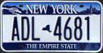
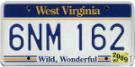

Each font needs to be trained separately.  You do not want to combine characters across fonts, this will greatly decrease your accuracy.  After each font is trained, they can be combined into one dataset for your entire country.

Creating the character tiles
----------------------------
Once you're ready to start training, you'll need to create a library of character tiles.  Each tile is a small image file that contains the black-and-white character and is named after the character.  For example, here are a few character tile examples:

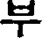

부-0-0-2.png

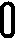

0-0-az2012.png

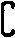

c-1-az2012.png

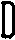

d-9-az2012.jpg

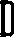

d-9-2-az2012.jpg

You will want many of these character tiles for each character and each font.  The character tiles are all going to be slightly different, this is necessary for the OCR training to understand how to detect characters.  Notice in the above examples, the "D" characters have pixels located in different places, but they're clearly the same character.

Producing Tiles
----------------
There are two good ways to produce character tiles.

  1. Use actual images from license plates
  2. Use a TTF font that looks like the license plate font

Producing Tiles from Actual Plates
------------------------------------

You should gather a large library of license plate images (At least 100).  These license plate images should be cropped around the plate and the aspect ratio should match your configured width/height for your license plates.  Make sure each image is at least 250px wide.  The imageclipper program (separate repo) is helpful for quickly cropping large numbers of images.  Save them as png files.

Each file should be prefaced with a two character identifier for the font/region.  For example, for Maryland plates, we would name the file: **md**\ plate1.png

Create an empty output directory.

To start classifying characters, use the classifychars utility program included in OpenALPR.

Execute the command:
  classifychars [country] [input image directory] [empty output directory]

A GUI will open up and analyze each license plate image in your input folder.  The steps to classify each plate are:
    1. Press the "Enter" key and type the letter or number for each position that you wish to classify.  Pressing 'Space' will skip the character.
    2. Use the arrow keys and press 'Space' to select the rendering that you wish to extract characters for.  The box will be highlighted in blue if it is selected.  For each plate, there may be good characters and bad characters.  You want to pick the best characters, since significant imperfections may confuse the OCR.
    3. Press the 's' key to save each character as a separate file in your out folder.
    4. Press the 'n' key to move onto the next plate and repeat this process until you've classified all the plates.

Producing Tiles from a TTF Font
-------------------------------
A TTF font can be used to produce tiles.  However, we need to add some realistic distortion to the characters.  This is necessary to make a robust OCR detector.

The process is as follows:

    1. Figure out all the characters that could possibly be in a license plate.
    2. Create a word document with all of these characters.  Make sure there is plenty of spacing between lines and characters.
    3. Copy and paste all of these characters to a text file (no spaces or line breaks)
    4. Print this word document.
    5. Take a few pictures (5 would be sufficient) of the word document with a digital camera.  Vary the angle/rotation very slightly (1-2 degrees) with each picture.
    6. Save the pictures to a folder.
    7. Run the openalpr-utils-binarizefontsheet program to produce tiles from each of the images.  Provide the program with the text file from step #3 and each image file.

Building a Tesseract Training Sheet
-----------------------------------

Once you've classified all the characters, it may be a good idea to scan through the directory to make sure that the classifications match the images.  Each image filename should be prefaced with the character that it represents.  Once you've done this, it's time to create a training sheet.

The "openalpr-utils-prepcharsfortraining" utility program in OpenALPR will create the Tesseract training sheet for you.  Execute the following command:
openalpr-utils-prepcharsfortraining [output directory from above]

The output will be:
  - combined.box
  - combined.tif

Rename these files to match the naming convention used by Tesseract (explained above).  For example, leu.germany.exp0.box

You should create a training sheet for each unique license plate font that you wish to train.

Finish OCR Training
---------------------

Lastly, you'll use the box/tif files created above to train your country's license plate OCR.  Create a new directory using your country code, and create an input directory within it.  Copy all the box/tif files created in the previous steps into this directory.

Execute the "train.py" file.  Type in your country code.

If all went well, you should have a new file named l[countrycode].traineddata.  Copy this file into your runtime_directory (runtime_data/ocr/tessdata/) and it is now ready for OpenALPR to use.

Tesseract may report issues.  Most commonly it will complain that it could not line up the boxes on the provided image.  If you are getting many of these warnings, you can re-run the openalpr-utils-prepcharsfortraining utility and provide values for --tile_width and --tile_height.  Using different values will change how Tesseract sees the image and potentially improve results.

Training the Detector
========================

The detector finds the general location of a license plate in an image.  A single detector can support many different plate styles, as long as they generally have the same aspect ratio.  For example, in the USA, license plates are 12 inches by 6 inches (i.e., an aspect ratio of 2:1).

To train a license plate detector, you will need:

  1. 3000+ clear images of license plates
  2. 40-60 hours of free time

`This repository <http://github.com/openalpr/train-detector>`_  contains scripts that will help train a license plate detector for a particular region.  Your trained region detector can then be used in OpenALPR.

The license plate region detector uses the Local Binary Pattern (LBP) algorithm.  In order to train the detector, you will need many positive and negative images.  This repository already contains a collection of negative images.  You will need to add your own positive images.

To get started, you will first need many cropped plate images containing positive license plate matches.  Please see the "eu" positive image folder in this repository to understand the types of plate images required.  The imageclipper program is helpful for creating these cropped images.

After you've collected many (hundreds to thousands) of positive plate images, the next step is to train the detector.  First you must configure the training script to use the correct dimensions.

Edit the prep.py script and change the WIDTH, HEIGHT, and COUNTRY variables to match the country that you are training.  The width and height should be proportional to the plate size (slightly larger is OK).  A total pixel area of around 650 seems to work best.  Also, adjust the path to your OpenCV libraries, if that needs to be changed.

Once you are ready to start training, enter the following commands:

  - rm ./out/``*``    (clear the out folder in case it has data from previous runs)
  - ./prep.py neg
  - ./prep.py pos
  - ./prep.py train
  - Copy the output from the above command onto the command line.  You should adjust the numStages to a smaller value (usually 12 stages works well, but it will depend on your input images).  You may also need to adjust the numPos value to a smaller number in order to complete the training.

Copy the out/cascade.xml file to your OpenALPR runtime directory (runtime_data/region/[countrycode].xml).  You should now be able to use the region for plate detection.

Developers Guide
=================

Accuracy can also be improved by modifying the recognition code, itself.  The OpenALPR library is binary-compatible with the commercial software.  Any improvements/modifications you make can be swapped in by replacing the openalpr.dll/libopenalpr.so with your modified version.  The information below describes the various stages involved in recognizing license plates.

OpenALPR Design
----------------

OpenALPR operates as a pipeline.  The input is an image, various processing occurs in stages, and the output is the possible plate numbers in the image.

The pipeline stages occur in the following order:

=======================  ===================================== ==============================================================================================
  Pipeline Phase                      C++ class                      Description                 
=======================  ===================================== ==============================================================================================
 Detection                regiondetector.cpp                    Finds potential license plate regions 
 Binarization             binarizewolf.cpp                      Converts the plate region image into black and white 
 Char Analysis            characteranalysis.cpp                 Finds character-sized "blobs" in the plate region  
 Plate Edges              platelines.cpp and platecorners.cpp   Finds the edges/shape of the license plate 
 Deskew                   licenseplatecandidate.cpp             Transforms the perspective to a straight-on view based on the ideal license plate size. 
 Character Segmentation   charactersegmenter.cpp                Isolates and cleans up the characters so that they can be processed individually 
 OCR                      ocr.cpp                               Analyzes each character image and provides multiple possible letters/confidences
 Post Processing          postprocess.cpp                       Creates a top n list of plate possibilities based on OCR confidences.  
                                                                Also performs a Regex match against region templates if requested. 
=======================  ===================================== ==============================================================================================

Detection
---------
The detection phase happens one time for each input image.  It uses the LBP algorithm (generally used for face detection) to find possible license plate regions (x,y, width, height).  Each of these regions is sent to the later pipeline phases for further processing.

The detection phase is usually the most processing-intensive phase.  It can be GPU accelerated to improve performance.

Binarization
------------
This phase (and all subsequent phases) occur multiple times -- once for each possible license plate region.

The binarization phase creates multiple binary images for each plate region.  The reason multiple binary images are used is to give us the best possible chance of finding all the characters.  A single binarized image may miss characters if the image is too dark or too light for example.  Binarization uses the Wolf-Jolien method as well as the Sauovola method with various parameters.  Each of the binary images are processed in subsequent phases.  

Character Analysis
------------------
Character analysis attempts to find character-sized regions in the plate region.  It does this by first finding all connected blobs in the license plate region.  Then it looks for blobs that are roughly the width and height of a license plate character and have tops/bottoms that are in a straight line with other blobs of similar width/height.

This analysis is done multiple times in the region.  It starts by looking for small characters, then gradually looks for larger characters.

If nothing is found in the region, then the region is thrown out and no further processing takes place.  If it finds some potential characters, then the character region is saved and further processing takes place.

Plate Edges
-----------
The next phase is to find the edges of the license plate.  Keep in mind that the detection phase is only responsible for identifying a possible region where a license plate may exist.  It often is going to provide a region that is a little larger or smaller than the actual plate.  The plate edges tries to find the precise top/bottom/left/right edges of the license plate.

The first step is to find all of the hough lines for the license plate region.  platelines.cpp processes the plate image and computes a list of horizontal and vertical lines.

platecorners uses this list as well as the character height (computed in Character Analysis) to find the likeliest plate line edges.  It uses a number of configurable weights to determine which edge makes the most sense.  It will try using a default edge (based on the ideal width/height of the plate) to see if that makes a good match.

Deskew
------
Given the plate edges, the deskew stage remaps the plate region to a standard size and orientation.  Ideally this will give us a correctly oriented plate image (no rotation or skew).

Character Segmentation
----------------------
The character segmentation phase tries to isolate all the characters that make up the plate image.  It uses a vertical histogram to find gaps in the plate characters.  This phase also cleans up the character boxes by removing small, disconnected speckles and disqualifying character regions that are not tall enough.  It also tries to remove "edge" regions so that the edge of the license plate doesn't inappropriately get classified as a '1' or an 'I'

OCR
---
The OCR phase analyzes each character independently.  For each character image, it computes all possible characters and their confidences.

Post Processing
---------------
Given a list of all possible OCR characters and confidences, post processing determines the best possible plate letter combinations.  It is organized as a top N list.  Post processing disqualifies all characters below a particular threshold.  It also has a "soft" thresholds -- characters that are below this threshold will still be added to the possible list, but they also add a possible blank character -- since it's possible that the low confidence character is not really part of the plate.

The post processing also handles region validation if requested.  For example, if I tell OpenALPR that this is a "Missouri" plate, then it will try and match the results against a template that matches the Missouri format (e.g., [char][char][number]-[char][number][char]).  So, for example, if the top 3 list was:
  - CFOCIG
  - CF0CIG
  - CF0C1G

The third entry matches the template, but the other two do not.  So, post processing will signal that the third entry is our best match.
