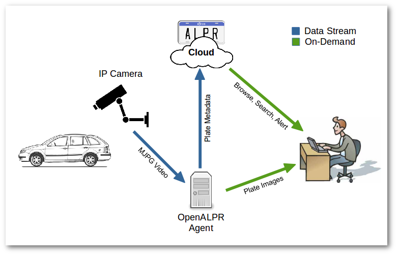
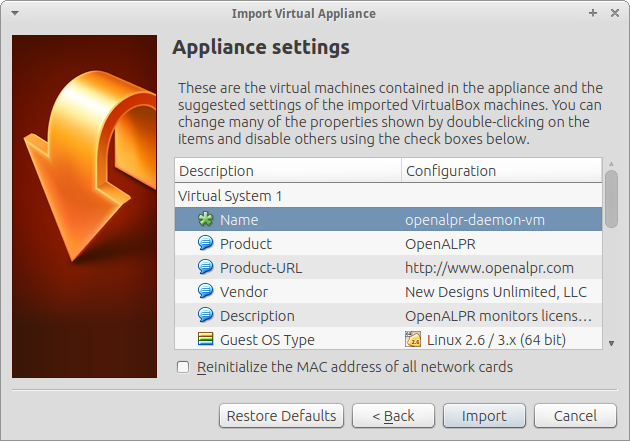
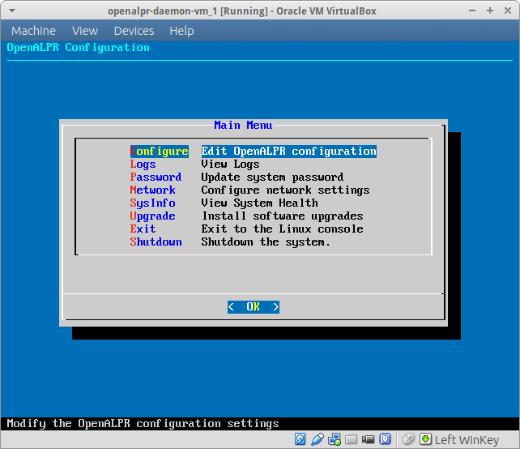
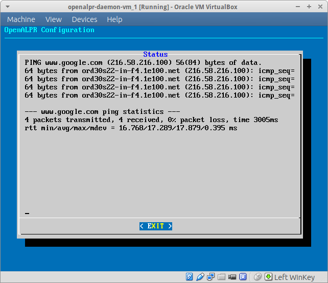
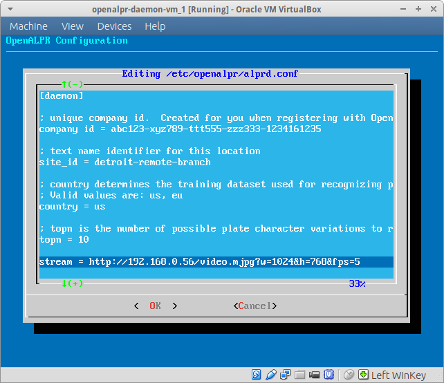

.. _web_server:

***********************
OpenALPR Web Server 
***********************

`*` Requires Commercial License

Requirements
================

OpenALPR Cloud collects metadata about license plates seen by your cameras. This data is browsable, searchable, and can trigger alerts. The Web server can be available either:

  #. In the cloud
  #. Installed On-Premises within your network

If you haven't seen the `live demo <http://www.openalpr.com/demo-cloud.html>`_, check it out! It shows a realistic example of the type of information you will soon be collecting from your cameras.

In order to get started, you will need:

  1. An IP camera capable of serving MJPEG or H264 video
  2. An OpenALPR agent installed on your network

First, configure your IP camera to capture the area that you wish to monitor. Generally, you'll want the video to be able to capture a clear image of the license plate in order for OpenALPR to properly identify the numbers. You may want to experiment with different optical zoom levels and resolutions to get the best image quality. A straight-on shot of the license plate is best, but OpenALPR can work with shots at an angle.

Once your camera is setup, make sure that it has an IP address and that you can connect to the MJPEG or H264 stream. Some cameras support arguments in the URL to control resolution, frame-rate, etc. The Firefox web browser has the best MJPEG support among major browsers. Type in the MJPEG or H264 stream URL to Firefox and you should be able to clearly see your video. Some users reduce the frames per second (fps) of their video feed in order to reduce the stream bandwidth. 

Architecture
=============

As depicted in the diagram above, the OpenALPR agent reads a video stream from your IP camera, processes it, and uploads plate metadata to the OpenALPR cloud. The agent also stores all of the plate images on a rolling buffer in its hard drive.

There is a constant stream of data flowing between the camera and the agent as well as between the agent and the cloud.  The data sent to the cloud is relatively low-bandwidth because it contains text metadata describing the license plates, and not the images.  When you log into the OpenALPR Cloud web portal to view your data, that information is retrieved on-demand. OpenALPR Cloud does not store your plate images, these are downloaded directly from the agent when you select a plate to view.

Web Server Installation
===============================

On an Ubuntu 14.04 64-bit server:

Add the OpenALPR GPG key and setup the OpenALPR deb repository

.. code-block:: bash

    wget -O - http://deb.openalpr.com/openalpr.gpg.key | sudo apt-key add -
    echo "deb http://deb.openalpr.com/commercial/ trusty main" | sudo tee /etc/apt/sources.list.d/openalpr.list

    sudo apt-get update && sudo apt-get -y install openalpr-web

You will be prompted to create a MySQL database password.  Type in a value that is secure and that you will remember.

Configure OpenALPR by typing:

.. code-block:: bash

    openalpr-web-createdb

You will be prompted for the MySQL database password.  Type in the same value entered above.

Next, you will need to create an administrative user account.  Type in an e-mail address and a password for this new user.  You will use this to login to the web interface once it's started

Connect to the web interface by opening a browser and going to: *http://[System_IP_address]*

If you don't already know the system IP address, it can be found by typing ifconfig.

Login with the user e-mail and password that you just created.

Click on the "Getting Started" link and make note of your "Company ID."  You will need this to configure the agents and to setup API integrations.  This value should be kept secure and should be treated like a password. 

Agent Installation
===================

The :ref:`OpenALPR agent <alprd>`  is installed as either a Virtual Machine (VM) or a Debian install for 64-bit Ubuntu Linux. The VM installs in a few minutes and can run on any operating system (e.g., Windows, Linux, Mac OS X). The Debian installer for 64-bit Ubuntu Linux is a more advanced install option.

Virtual Machine Install
-------------------------

- Start downloading the `latest OpenALPR Virtual Machine <http://deb.openalpr.com/downloads/openalpr.ova>`_.
- Download and install the `VirtualBox installer <https://www.virtualbox.org/wiki/Downloads>`_ for your operating system. The OpenALPR VM will also work with other hypervisors such as VMware, Xen, or HyperV if you prefer to use one of those.
- Open VirtualBox and choose File → Import Appliance
- Choose the openalpr.ova file downloaded in step #1
- Accept the default memory and CPU settings and click "Import"

- Select the openalpr-agent-vm and click "Start"
- The VM should boot up quickly and provide you with a login prompt. Login with the default credentials: admin/admin
- You should see a menu like the one below. Use the up/down, tab, and enter keys to navigate the menu.

- First setup the network by choosing **Network** → **eth0**.
    - Select either DHCP or static depending on your LAN configuration
    - Select Network → Test and make sure that you can successfully ping www.google.com

- Select **Upgrade** from the main menu. The OpenALPR software is updated more frequently than the VM, there may be updates available.
- Optional Steps:
  
  - Optionally, select **Password** from the main menu to change your password to something more secure.
  - You may optionally install the OpenALPR web server onto this VM.  Select **Install Web** to start the install process.  Doing this will allow you to search, browse, and alert on license plates from your local VM rather than from the cloud.  This requires an on-premises license, please contact info@openalpr.com for an evaluation license.
- Select **Configure** from the main menu.  This will provide you with a URL to connect to in a browser to complete the process.  
  
  - You will be directed to: http://[Agent-IP-Address]/agentconfig

- In the agentconfig web interface, select **Remote Connection**.  This connects your local agent with your web server.  If using the cloud service, the web server is located at cloud.openalpr.com.  Otherwise it is the IP/hostname of the server where you installed the OpenALPR web software.  If you installed OpenALPR on the same system, use **localhost**.
- Type in your username (e-mail address) and password, and click **Connect**.  You should see a message indicating that the connection was successful.
- Click **Agent Config**
  - You may be prompted to login.  Use the e-mail address and password that you just used to authenticate with the web server.

.. image:: images/webserver_vminstall5.png
    :scale: 100%
    :alt: OpenALPR VM installation step 4

- Scroll to the bottom and add a video stream.
- Select the model of IP camera you wish to connect to.  Fill in the IP address.  If the camera requires credentials, check the box and enter your camera's username and password.
- Click **Test**.  After a few seconds, you will see a window indicating whether the connection was successful or not.  If it was successful, click **Save Camera**.  Otherwise, try another option (such as H264 Alt1 or MJPEG) and click **Test** again until you succeed.

.. image:: images/webserver_vminstall-testsuccess.png
    :scale: 100%
    :alt: OpenALPR VM installation step 4

- Next, configure the **Agent Parameters**.  

  - Choose a sensible name for your **Site ID**.  This is usually the location of the agent system (e.g., headquarters, dallas-branch, warehouse3, etc.).  Each agent should be given a unique Site ID.
  - Choose the **country** where the camera is located.  US will recognize North American-style plates (12 inches x 6 inches).  EU will recognize European-style plates.  There is also support for other countries that have plates with different dimensions.
  - The number of **Processing Cores**  controls how much CPU is allocated to the LPR process.  The more processing cores you provide (up to the number of CPU cores on the system) the more frames per second (fps) you can process.  Higher fps generally contributes to better accuracy and capability to detect plates on faster moving vehicles.
  - **Disk Quota** controls how much space is reserved for storing vehicle and license plate images.  It operates as a rolling buffer, so once it runs out of space, the oldest images are removed.
  - **Pattern** should be set to the State (in the USA) or country (in Europe) that the camera is located in.  This gives OpenALPR additional information about the patterns on the plates.  It won't disqualify values from other states/countries, but it will help weigh results to give higher confidence to plates that do match the pattern.

- Click **Update**.

.. image:: images/webserver_vminstall6.png
    :scale: 100%
    :alt: OpenALPR VM installation step 4

- Lastly, if you scroll to the top of the page you can watch the agent status.  At this point you should see **Video FPS** and other information indicating that video is being pulled from the camera and license plates are being recognized.  Now that the agent is configured, it will continue collecting data from the configured video streams.  If the agent is rebooted, it will pick back up on restart.  If the camera goes down and comes back, or the network is down temporarily, the agent will retry until connectivity is restored.  All results are queued, so no data is lost in the event of an outage.

.. image:: images/webserver_vminstall7.png
    :scale: 100%
    :alt: OpenALPR VM installation step 4

- Click on the **Web Server** link at the top of the page to start browsing license plate results.

On an Ubuntu 14.04 64-bit Linux Install
---------------------------------------

Alternatively, you may prefer to install the OpenALPR agent directly onto the server.   These steps are not required if you installed the Virtual Machine referenced above.

First install a copy of `Ubuntu 14.04 64-bit Linux server <http://www.ubuntu.com/download/server/thank-you?country=US&version=14.04.3&architecture=amd64>`_ and gain console access.

From the terminal:

.. code-block:: bash

    # Install the OpenALPR repository GPG key
    wget -O - http://deb.openalpr.com/openalpr.gpg.key | sudo apt-key add -

    # Add the OpenALPR repository to your server
    echo "deb http://deb.openalpr.com/commercial/ trusty main" | sudo tee /etc/apt/sources.list.d/openalpr.list

    # Install the OpenALPR software
    sudo apt-get update
    sudo apt-get install openalpr openalpr-daemon openalpr-utils libopenalpr-dev openalpr-daemonconfig
             

You may use the web interface to configure the agent (http://[agent-ip-address]/agentconfig or you may edit the configuration file /etc/openalpr/alprd.conf

Configure the company_id, site_id, country, and stream values as described in the Virtual Machine section. Make sure that the value for upload_data is set to 1 and that the upload_address setting is configured to http://[on_premises_webserver]/push

.. code-block:: bash

    # Restart the alprd process
    sudo service openalprd-daemon start

    # Tail the logs to see if the daemon is running successfully
    tail -f /var/log/alpr.log
                    
If all goes well, the log should show that the video stream is being processed and plates are being identified and uploaded. Once a plate is uploaded it should show up on the OpenALPR Cloud dashboard after a few seconds.

.. _web_services_api:

Web Services API
------------------

The `Web Services API <api/>`_ can be used to query your On-Premises server for data.  The API is documented `here <api/>`_